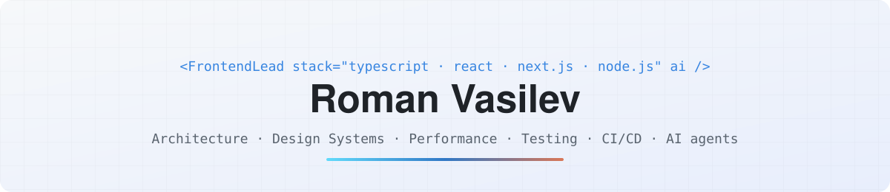

<p align="center">
  <picture>
    <source media="(prefers-color-scheme: dark)" srcset="./assets/banner-dark.svg">
    
  </picture>
</p>

<p align="center">
  <b>Senior Frontend Engineer · React / TypeScript · AI-assisted development</b><br>
  10+ years · travel-tech · fintech · gov-tech · startup MVPs
</p>

<p align="center">
  <samp>
    <a href="https://www.linkedin.com/in/roman-vasilev-1742191b8">linkedin</a> .
    <a href="https://t.me/don_macron">telegram</a> .
    <a href="mailto:zvezdarusy@gmail.com">email</a> .
    <a href="#english">english</a> .
    <a href="#русский">русский</a>
  </samp>
</p>

<p align="center">
  <br>
  
</p>

---

## English

Senior frontend engineer and feature lead. I build a corporate travel platform (flights, rail,
hotels) as a React 19 SPA in a pnpm + Turborepo monorepo, and the **Claude Code harness** the team
uses to take a task from ticket to merge request.

### Stack

|                   |                                                                                                                          |
| ----------------- | ------------------------------------------------------------------------------------------------------------------------ |
| **Core**          | TypeScript · JavaScript · React 19 · React Native · Next.js (SSR/SSG) · Node.js                                          |
| **State & data**  | Redux Toolkit / RTK Query · MobX · Zustand · Effector · Context API · Axios · REST · WebSockets                          |
| **UI & styling**  | Mantine · Recharts · CSS Modules · Less · Sass · Stylus · Styled Components · Emotion · Tailwind · BEM · micro-frontends |
| **Forms & i18n**  | Mantine Form · React Hook Form · Formik · Yup · React IMask · i18next · Day.js · date-fns                                |
| **Build**         | Vite · Webpack · Rollup · Babel · pnpm workspaces · Turborepo · ESLint · Prettier · Husky + commitlint                   |
| **Testing**       | Playwright · Cypress · Vitest · Jest · React Testing Library · Storybook 10 · pixel-diff snapshots                       |
| **Infra**         | Express (SSR, API proxy) · Docker · Nginx · GitLab CI · GitHub Actions · PWA · SEO                                       |
| **Observability** | LogRocket · Yandex Metrica · Carrot Quest                                                                                |
| **Quality**       | WCAG 2.1 · role-based permissions · 2FA (SMS + TOTP) · DOMPurify · Core Web Vitals                                       |
| **AI**            | Claude Code · Codex · Cursor · MCP · multi-agent pipelines · retrieval over docs                                         |

### AI harness

|                 |                                                                                                                                              |
| --------------- | -------------------------------------------------------------------------------------------------------------------------------------------- |
| **Agents**      | `arch` → `coder` → `reviewer` (ticket → plan → code → review) + `debug`, `e2e`; one `/dev` command runs the chain                            |
| **Skills (34)** | Codebase conventions as executable instructions: RTK Query, Redux, DTOs, forms, errors, i18n, routing, permissions, payments, Storybook, e2e |
| **Review**      | One rulebook, two entry points: local self-check and GitLab MR review with preview before posting                                            |
| **Hooks & MCP** | Type-check after edits, Jira transitions, commit guard · Jira, Confluence, GitLab, Figma, Playwright, LogRocket                              |
| **Tooling**     | One-command setup check · API record/replay interceptor · visual probes · proxy Chrome extension                                             |

**Retrieval over docs** — no vector DB: agents navigate a Markdown knowledge graph.

```
Confluence (600+ spec pages) ─sync─▶ Obsidian vault · YAML frontmatter · domain taxonomy · [[wikilink]] graph
Architecture docs ───────────mirror─▶ service map · routing · HTTP / queue maps
200+ backend repos ───────inventory─▶ entity → service → shared-types contract
                                      ▼
          arch agent: domain → search → read → follow links → plan with cited sources
```

### Experience

|             |                                 |                                                                                                                                                              |
| ----------- | ------------------------------- | ------------------------------------------------------------------------------------------------------------------------------------------------------------ |
| 2024 → now  | **Aero Club** · business travel | Senior Frontend / R&D. Monorepo migration, booking & payments (overdraft, deposit, card), travel policies, unified auth, AI harness                          |
| 2021 – 2024 | **SoftMediaLab**                | Senior Frontend. Lead FE on a payments platform: WebSocket dashboards, LCP −35%, 5 payment providers. Utility and gov-tech portals: WCAG 2.1, 2FA, 3 locales |
| 2021        | **Channex.io**                  | Frontend. SaaS channel manager: calendars, dashboards, Booking.com / Airbnb integrations                                                                     |
| 2018 – 2021 | **Purrweb** · MVP studio        | Frontend. Shipped startup MVPs from scratch — SPA, isomorphic Next.js, React Native; shared design system for 3+ projects, LCP −40%, CI/CD                   |
| 2017        | **AffContext**                  | Frontend. Interfaces, landing pages, CRM integration                                                                                                         |

---

## Русский

Senior frontend-разработчик и фича-лид. Делаю корпоративную платформу деловых поездок (авиа, ЖД,
отели) — SPA на React 19 в pnpm + Turborepo-монорепо — и **харнесс на Claude Code**, через который
команда ведёт задачу от тикета до мерж-реквеста.

### Стек

|                        |                                                                                                                         |
| ---------------------- | ----------------------------------------------------------------------------------------------------------------------- |
| **Основа**             | TypeScript · JavaScript · React 19 · React Native · Next.js (SSR/SSG) · Node.js                                         |
| **Состояние и данные** | Redux Toolkit / RTK Query · MobX · Zustand · Effector · Context API · Axios · REST · WebSockets                         |
| **UI и стили**         | Mantine · Recharts · CSS Modules · Less · Sass · Stylus · Styled Components · Emotion · Tailwind · БЭМ · микрофронтенды |
| **Формы и i18n**       | Mantine Form · React Hook Form · Formik · Yup · React IMask · i18next · Day.js · date-fns                               |
| **Сборка**             | Vite · Webpack · Rollup · Babel · pnpm workspaces · Turborepo · ESLint · Prettier · Husky + commitlint                  |
| **Тесты**              | Playwright · Cypress · Vitest · Jest · React Testing Library · Storybook 10 · попиксельные снапшоты                     |
| **Инфраструктура**     | Express (SSR, API-прокси) · Docker · Nginx · GitLab CI · GitHub Actions · PWA · SEO                                     |
| **Наблюдаемость**      | LogRocket · Яндекс.Метрика · Carrot Quest                                                                               |
| **Качество**           | WCAG 2.1 · ролевая модель прав · 2FA (SMS + TOTP) · DOMPurify · Core Web Vitals                                         |
| **AI**                 | Claude Code · Codex · Cursor · MCP · мультиагентные пайплайны · поиск по документации                                   |

### AI-харнесс

|                 |                                                                                                                                     |
| --------------- | ----------------------------------------------------------------------------------------------------------------------------------- |
| **Агенты**      | `arch` → `coder` → `reviewer` (тикет → план → код → ревью) + `debug`, `e2e`; команда `/dev` гоняет цепочку                          |
| **Скиллы (34)** | Конвенции кодовой базы как исполняемые инструкции: RTK Query, Redux, DTO, формы, ошибки, i18n, роуты, права, оплаты, Storybook, e2e |
| **Ревью**       | Один свод правил, два входа: локальный self-check и ревью GitLab MR с превью перед публикацией                                      |
| **Хуки и MCP**  | Тип-чек после правок, переходы в Jira, защита коммитов · Jira, Confluence, GitLab, Figma, Playwright, LogRocket                     |
| **Обвязка**     | Проверка окружения одной командой · интерсептор записи/реплея API · визуальные пробы · прокси-расширение для Chrome                 |

**Поиск по документации** — без векторной базы: агенты ходят по графу знаний на Markdown.

```
Confluence (600+ спек) ──sync─▶ Obsidian-vault · YAML frontmatter · доменная таксономия · граф [[wikilinks]]
Архитектурные доки ────mirror─▶ карта сервисов · роутинг · HTTP и очереди
200+ бэкенд-репо ───inventory─▶ сущность → сервис → контракт shared-types
                                ▼
        arch-агент: домен → поиск → чтение → ссылки → план с источниками
```

### Опыт

|               |                                |                                                                                                                                                                         |
| ------------- | ------------------------------ | ----------------------------------------------------------------------------------------------------------------------------------------------------------------------- |
| 2024 → сейчас | **Аэро Клуб** · деловой туризм | Senior Frontend / R&D. Переезд в монорепо, оформление и оплата заказов (овердрафт, депозит, карта), тревел-политики, единая авторизация, AI-харнесс                     |
| 2021 – 2024   | **СофтМедиаЛаб**               | Senior Frontend. Ведущий фронтенд платёжного сервиса: дашборды на WebSockets, LCP −35%, 5 платёжных провайдеров. Порталы энергосбыта и соцкарты: WCAG 2.1, 2FA, 3 языка |
| 2021          | **Channex.io**                 | Frontend. SaaS-агрегатор бронирований: календари, дашборды, интеграции с Booking.com и Airbnb                                                                           |
| 2018 – 2021   | **Purrweb** · студия MVP       | Frontend. MVP для стартапов с нуля — SPA, изоморфный Next.js, React Native; общая дизайн-система для 3+ проектов, LCP −40%, CI/CD                                       |
| 2017          | **AffContext**                 | Frontend. Интерфейсы, лендинги, интеграция с CRM                                                                                                                        |
